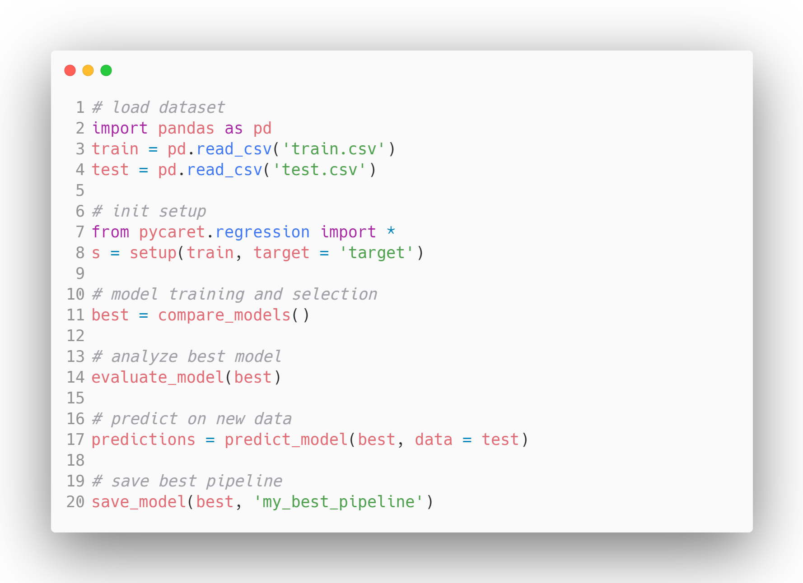
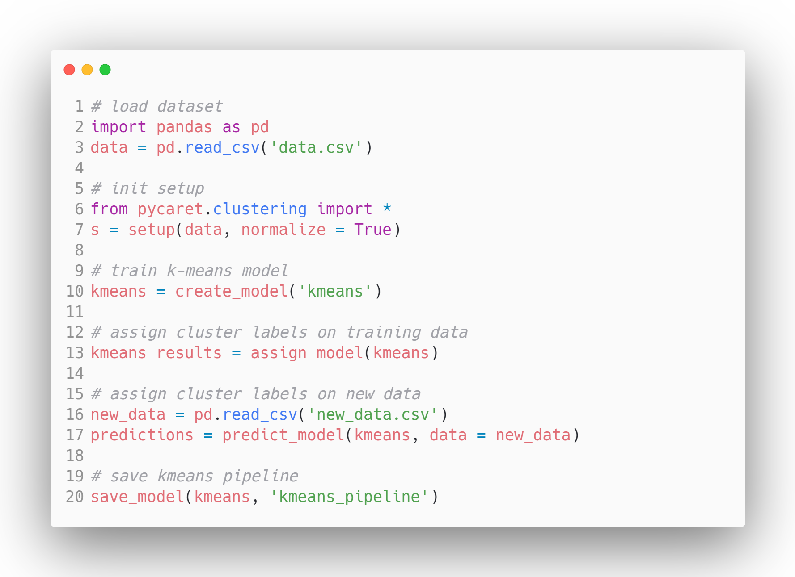
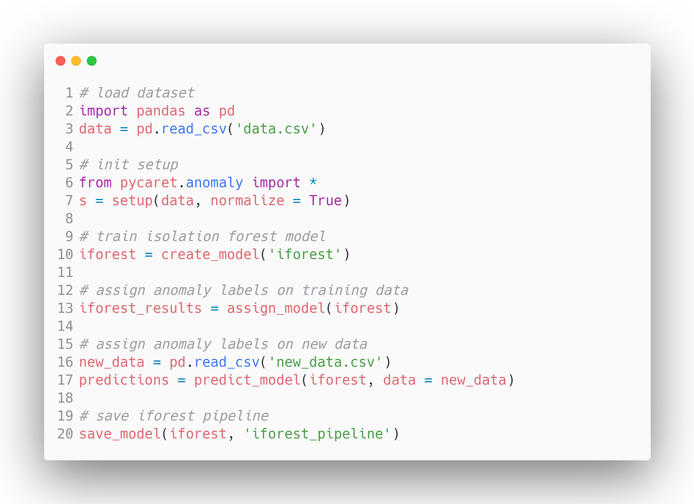

<div align="center">
  


**An open-source, low-code machine learning library in Python** </br>
:rocket: **PyCaret 3.0-rc is now out. `pip install --pre pycaret`**
  
<p align="center">
  <a href="https://www.pycaret.org">Official</a> •
  <a href="https://pycaret.gitbook.io/">Docs</a> •
  <a href="https://pycaret.gitbook.io/docs/get-started/installation">Install</a> •
  <a href="https://pycaret.gitbook.io/docs/get-started/tutorials">Tutorials</a> •
  <a href="https://pycaret.gitbook.io/docs/learn-pycaret/faqs">FAQs</a> •
  <a href="https://pycaret.gitbook.io/docs/learn-pycaret/cheat-sheet">Cheat sheet</a> •
  <a href="https://github.com/pycaret/pycaret/discussions">Discussions</a> •
  <a href="https://pycaret.readthedocs.io/en/latest/contribute.html">Contribute</a> •
  <a href="https://github.com/pycaret/pycaret/tree/master/resources">Resources</a> •
  <a href="https://pycaret.gitbook.io/docs/learn-pycaret/official-blog">Blog</a> •
  <a href="https://www.linkedin.com/company/pycaret/">LinkedIn</a> • 
  <a href="https://www.youtube.com/channel/UCxA1YTYJ9BEeo50lxyI_B3g">YouTube</a> • 
  <a href="https://join.slack.com/t/pycaret/shared_invite/zt-row9phbm-BoJdEVPYnGf7_NxNBP307w">Slack</a>

</p>

[](https://badge.fury.io/py/pycaret) 
 
[](http://pip.pypa.io/en/stable/?badge=stable) 
[](https://badge.fury.io/py/pycaret) 
[](https://img.shields.io/pypi/l/ansicolortags.svg) 
<!-- [](http://hits.dwyl.com/pycaret/pycaret/pycaret) -->
[](https://join.slack.com/t/pycaret/shared_invite/zt-row9phbm-BoJdEVPYnGf7_NxNBP307w)


<div align="left">
  
# Welcome to PyCaret
PyCaret is an open-source, low-code machine learning library in Python that automates machine learning workflows. It is an end-to-end machine learning and model management tool that speeds up the experiment cycle exponentially and makes you more productive.

In comparison with the other open-source machine learning libraries, PyCaret is an alternate low-code library that can be used to replace hundreds of lines of code with few lines only. This makes experiments exponentially fast and efficient. PyCaret is essentially a Python wrapper around several machine learning libraries and frameworks such as scikit-learn, XGBoost, LightGBM, CatBoost, spaCy, Optuna, Hyperopt, Ray, and few more.

The design and simplicity of PyCaret are inspired by the emerging role of citizen data scientists, a term first used by Gartner. Citizen Data Scientists are power users who can perform both simple and moderately sophisticated analytical tasks that would previously have required more technical expertise. PyCaret was inspired by the caret library in R programming language.

| Important Links              |                                                                |
| -------------------------- | -------------------------------------------------------------- |
| :star: **[Tutorials]**        | New to PyCaret? Checkout our official notebooks!            |
| :clipboard: **[Example Notebooks]** | Example notebooks created by community.               |
| :orange_book: **[Official Blog]** | Tutorials and articles by contributors.                      |
| :books: **[Documentation]**      | The detailed API docs of PyCaret                         |
| :tv: **[Video Tutorials]**            | Our video tutorial from various events.             |
| ✈️ **[Cheat sheet]**            | Cheat sheet for all functions across modules.             |
| :loudspeaker: **[Discussions]**        | Have questions? Engage with community and contributors.|
| :hammer_and_wrench: **[Changelog]**          | Changes and version history.                 |
| :deciduous_tree: **[Roadmap]**          | PyCaret's software and community development plan.|
  
[tutorials]: https://pycaret.gitbook.io/docs/get-started/tutorials
[Example notebooks]: https://github.com/pycaret/pycaret/tree/master/examples
[Official Blog]: https://pycaret.gitbook.io/docs/learn-pycaret/official-blog
[Documentation]: https://pycaret.gitbook.io
[video tutorials]: https://pycaret.gitbook.io/docs/learn-pycaret/videos
[Cheat sheet]: https://pycaret.gitbook.io/docs/learn-pycaret/cheat-sheet
[Discussions]: https://github.com/pycaret/pycaret/discussions
[changelog]: https://pycaret.gitbook.io/docs/get-started/release-notes
[roadmap]: https://github.com/pycaret/pycaret/issues/1756
 
# Installation

PyCaret's default installation only installs hard dependencies as listed in the [requirements.txt](requirements.txt) file. 

```python
pip install pycaret
```
To install the full version:

```python
pip install pycaret[full]
```

<div align="center">

# Supervised Workflow
  
  Classification           |  Regression
:-------------------------:|:-------------------------:
  | 

 # Unsupervised Workflow
  
  Clustering               |  Anomaly Detection
:-------------------------:|:-------------------------:
  |    
  
<div align="left">

# ⚡ PyCaret Time Series Module
  
PyCaret time series module is now available with the main pycaret installation. Staying true to simplicity of PyCaret, it is consistent with our existing API and fully loaded with functionalities. Statistical testing, model training and selection (30+ algorithms), model analysis, automated hyperparameter tuning, experiment logging, deployment on cloud, and more. All of this with only few lines of code (just like the other modules of pycaret). 
  
| Important Links              |                                                                |
| -------------------------- | -------------------------------------------------------------- |
| :star: **[Time Series Quickstart]**        | Get started with Time Series Analysis         |
| :books: **[Time Series Notebooks]**        | New to Time Series? Checkout our official (detailed) notebooks!            |
| :tv: **[Time Series Video Tutorials]**            | Our video tutorial from various events.             |
| :question: **[Time Series FAQs]**        |   Have questions? Queck out the FAQ's     |
| :hammer_and_wrench: **[Time Series API Interface]**        |   The detailed API interface for the Time Series Module          |
| :deciduous_tree: **[Time Series Features and Roadmap]**          | PyCaret's software and community development plan.|

[Time Series Quickstart]: https://pycaret.gitbook.io/docs/get-started/quickstart#time-series
[Time Series Notebooks]: https://pycaret.gitbook.io/docs/get-started/tutorials
[Time Series Video Tutorials]: https://pycaret.gitbook.io/docs/learn-pycaret/videos#pycaret-time-series-module
[Time Series FAQs]: https://github.com/pycaret/pycaret/discussions/categories/faqs?discussions_q=category%3AFAQs+label%3Atime_series
[Time Series API Interface]: https://pycaret.readthedocs.io/en/latest/api/time_series.html
[Time Series Features and Roadmap]: https://github.com/pycaret/pycaret/issues/1648
  
# Installation
  
 ```
 pip install --pre pycaret
 ```  

  

# Who should use PyCaret?
PyCaret is an open source library that anybody can use. In our view the ideal target audience of PyCaret is: <br />

- Experienced Data Scientists who want to increase productivity.
- Citizen Data Scientists who prefer a low code machine learning solution.
- Data Science Professionals who want to build rapid prototypes.
- Data Science and Machine Learning students and enthusiasts.
  
# PyCaret GPU support
With PyCaret >= 2.2, you can train models on GPU and speed up your workflow by 10x. To train models on GPU simply pass `use_gpu = True` in the setup function. There is no change in the use of the API, however, in some cases, additional libraries have to be installed as they are not installed with the default version or the full version. As of the latest release, the following models can be trained on GPU:

- Extreme Gradient Boosting (requires no further installation)
- CatBoost (requires no further installation)
- Light Gradient Boosting Machine requires [GPU installation](https://lightgbm.readthedocs.io/en/latest/GPU-Tutorial.html)
- Logistic Regression, Ridge Classifier, Random Forest, K Neighbors Classifier, K Neighbors Regressor, Support Vector Machine, Linear Regression, Ridge Regression, Lasso Regression requires [cuML >= 0.15](https://github.com/rapidsai/cuml)

# PyCaret Intel sklearnex support
You can apply [Intel optimizations](https://github.com/intel/scikit-learn-intelex) for machine learning algorithms and speed up your workflow. To train models with Intel optimizations use `sklearnex` engine. There is no change in the use of the API, however, installation of Intel sklearnex is required:

```pip install scikit-learn-intelex```

# License
PyCaret is completely free and open-source and licensed under the [MIT](https://github.com/pycaret/pycaret/blob/master/LICENSE) license. 

# Contributors
<a href="https://github.com/pycaret/pycaret/graphs/contributors">
  
</a>
