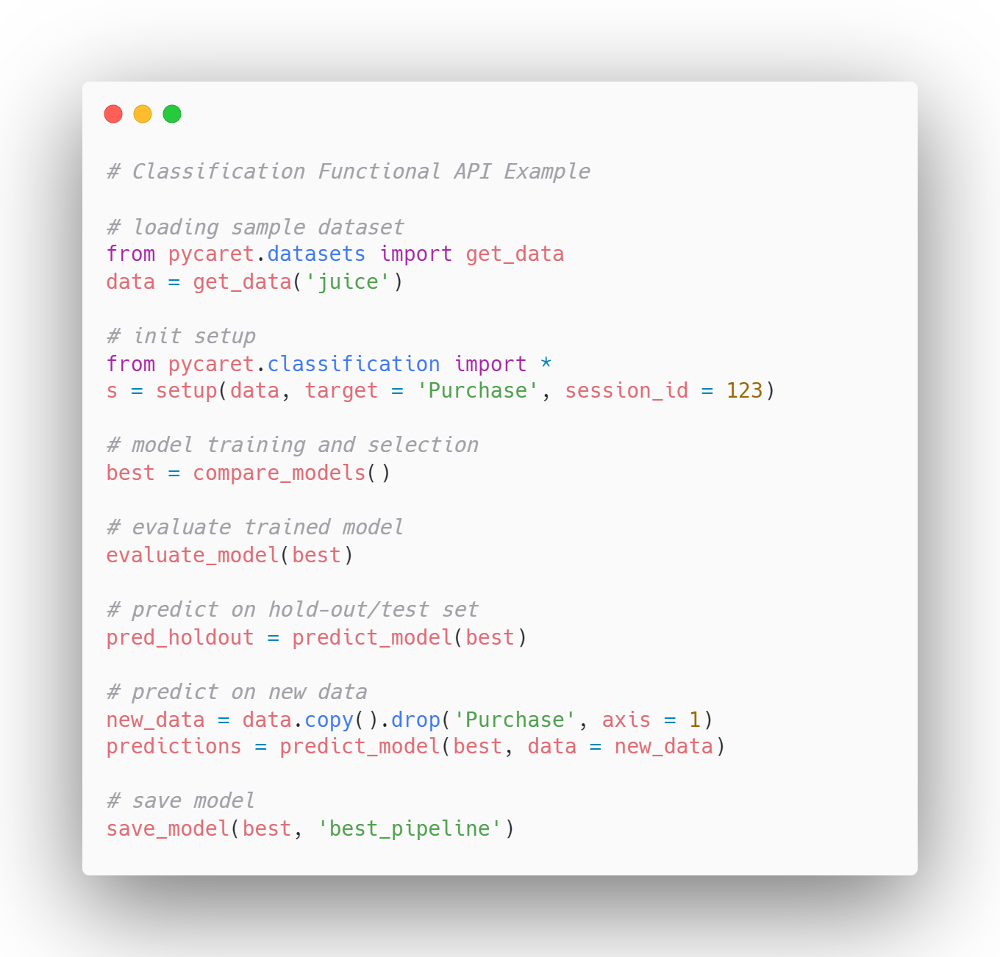
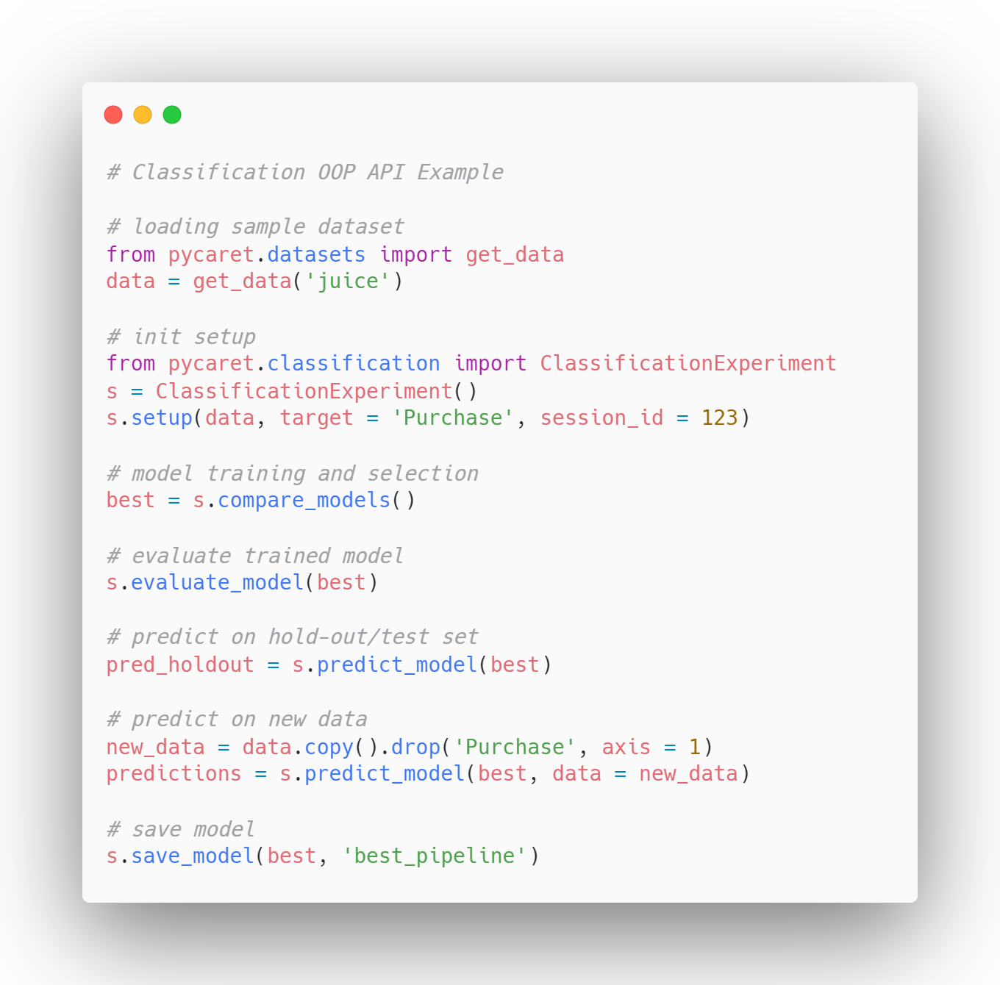
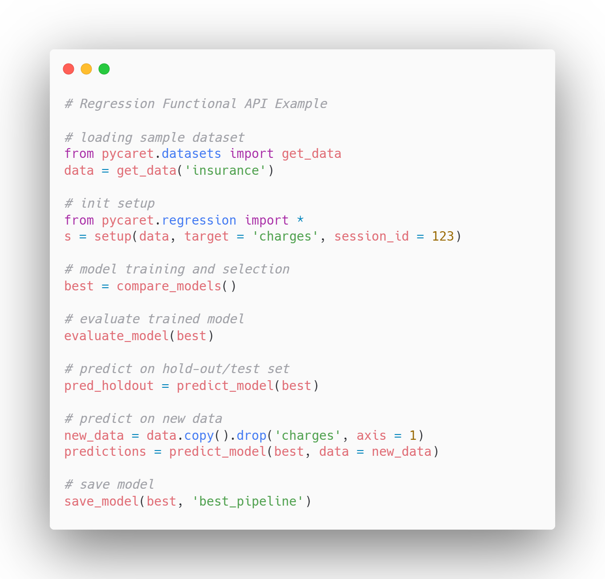
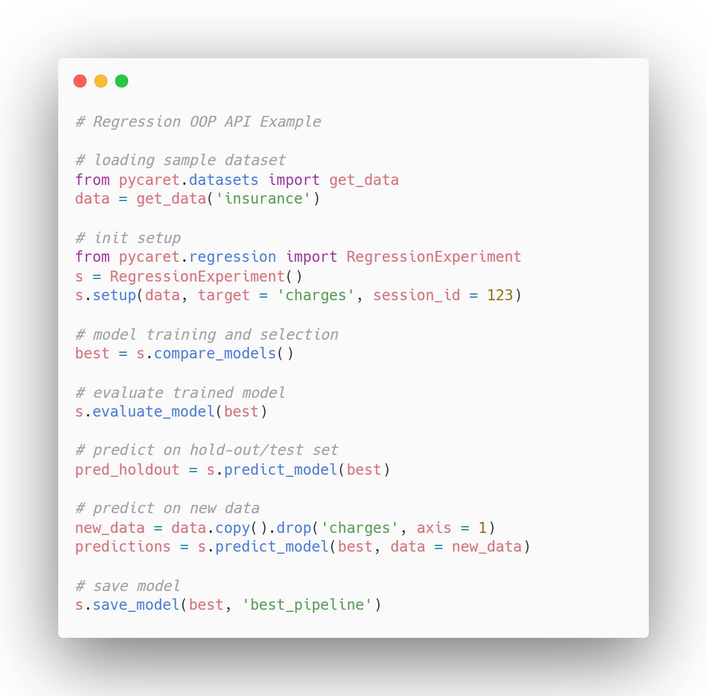
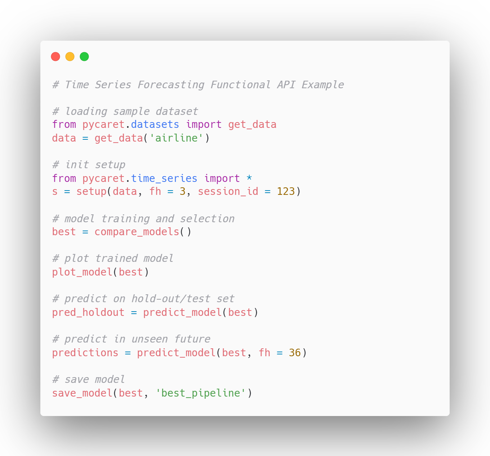
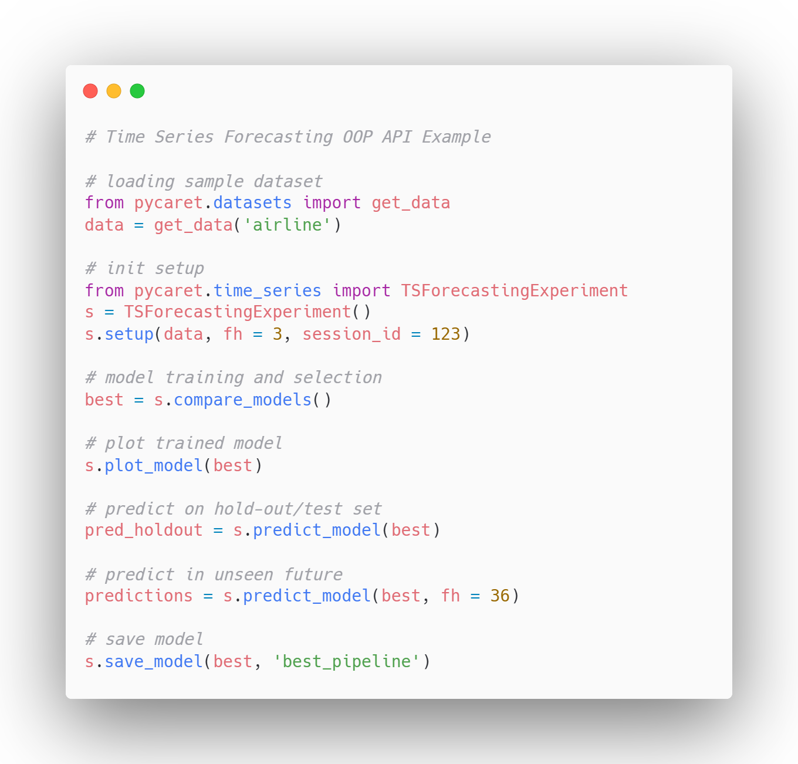
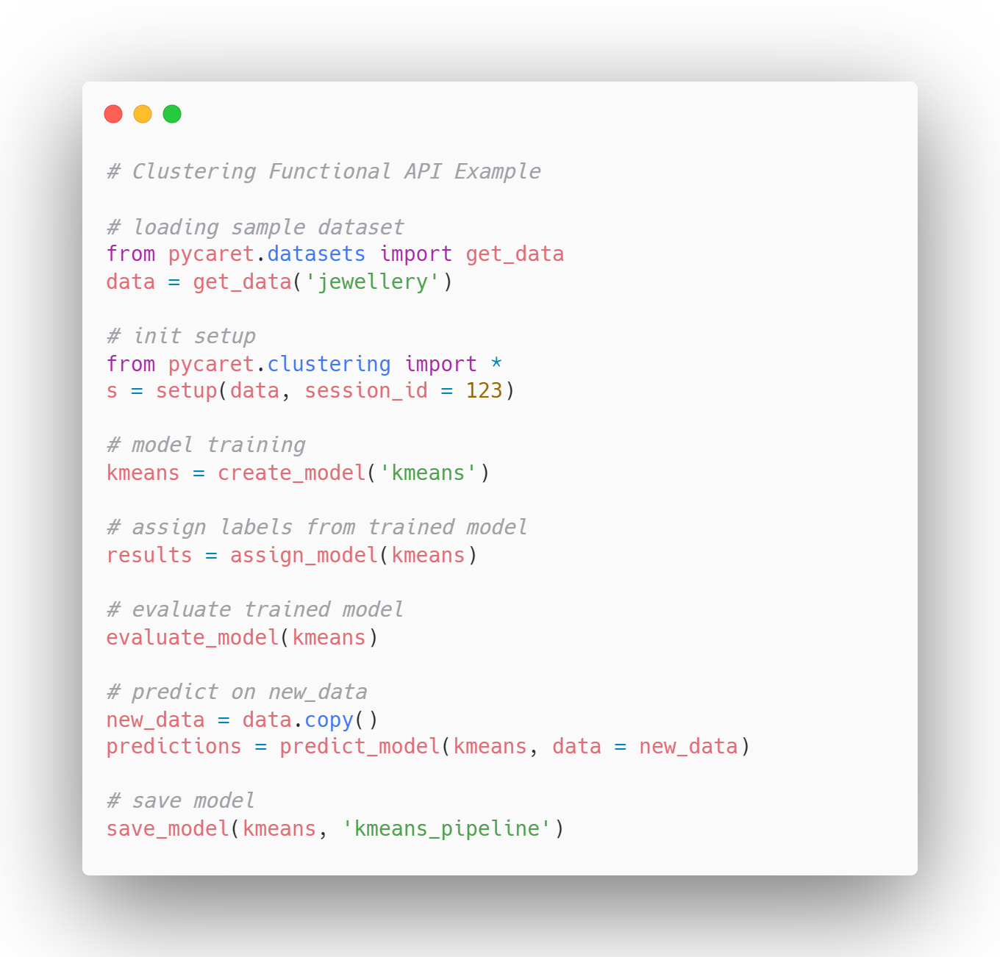
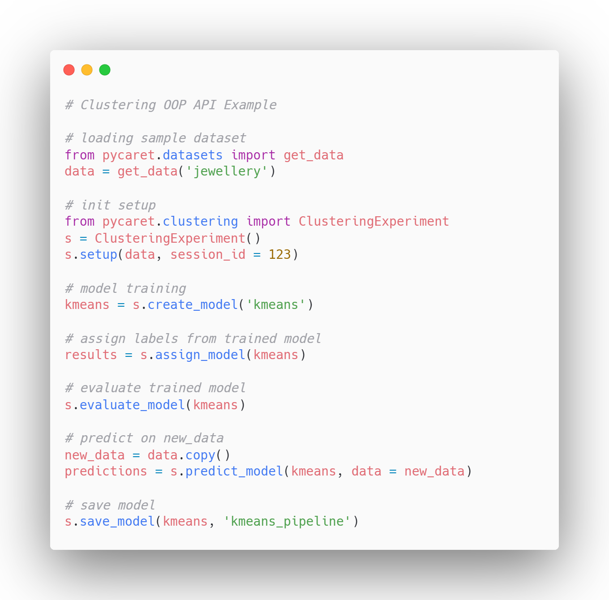
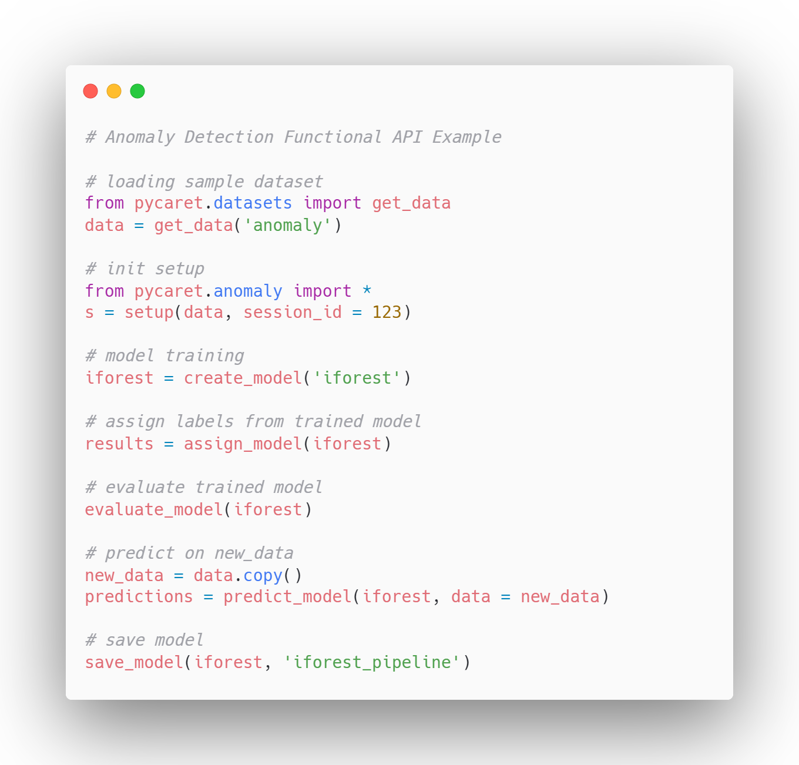
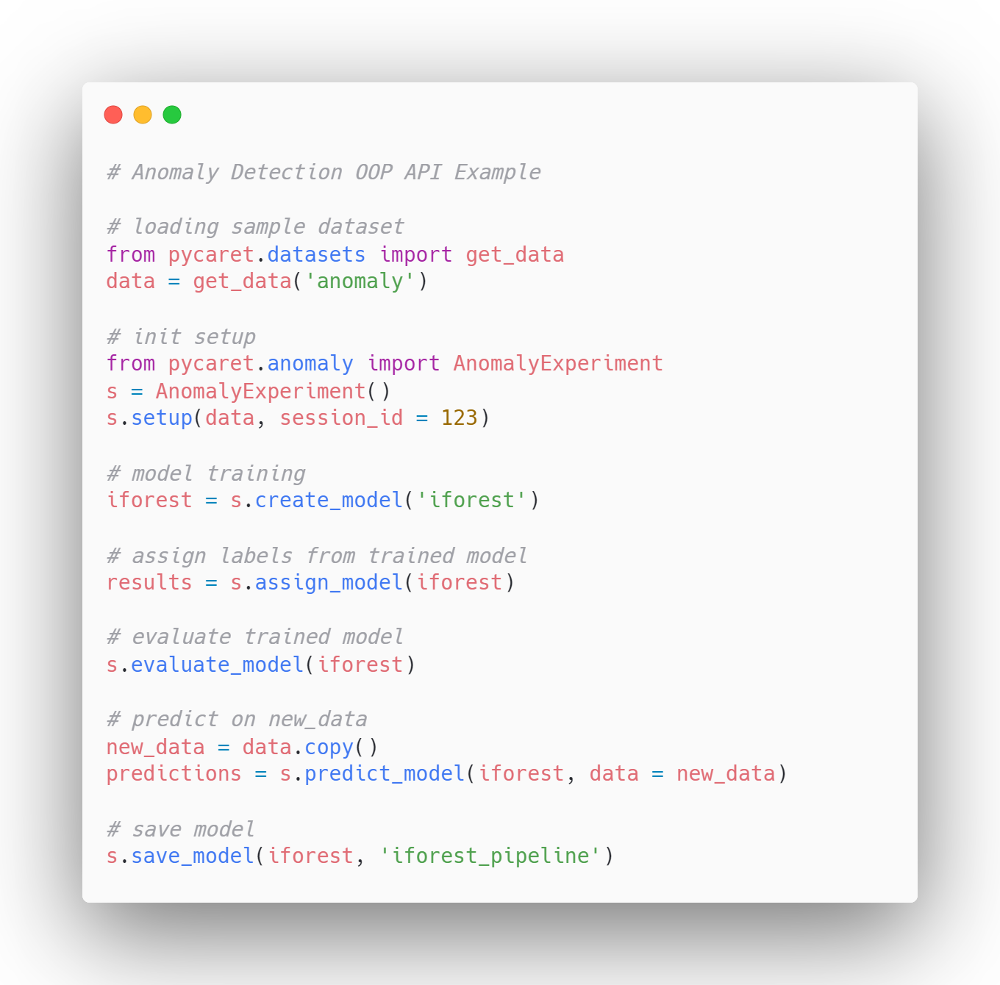

<div align="center">


## **An open-source, low-code machine learning library in Python**
## 🎉🎉🎉 **PyCaret 3.4 is now available. 🎉🎉🎉**
## `pip install --upgrade pycaret` </br>

<p align="center">
<h3>
  <a href="https://pycaret.gitbook.io/">Docs</a> •
  <a href="https://pycaret.gitbook.io/docs/get-started/tutorials">Tutorials</a> •
  <a href="https://pycaret.gitbook.io/docs/learn-pycaret/official-blog">Blog</a> •
  <a href="https://www.linkedin.com/company/pycaret/">LinkedIn</a> •
  <a href="https://www.youtube.com/channel/UCxA1YTYJ9BEeo50lxyI_B3g">YouTube</a> •
    <a href="https://join.slack.com/t/pycaret/shared_invite/zt-row9phbm-BoJdEVPYnGf7_NxNBP307w">Slack</a>
</h3>
</p>

| Overview | |
|---|---|
| **CI/CD** |  [](http://pip.pypa.io/en/stable/?badge=stable) |
| **Code** |  [](https://pypi.org/project/pycaret/) [](https://badge.fury.io/py/pycaret) [](https://github.com/psf/black)
| **Downloads**| [)](https://pepy.tech/project/pycaret) [)](https://pepy.tech/project/pycaret) [)](https://pepy.tech/project/pycaret) |
| **License** | [](https://img.shields.io/pypi/l/ansicolortags.svg)
| **Community** | [](https://join.slack.com/t/pycaret/shared_invite/zt-20gl4zb8k-L~ZQDyi9LtrV4dWxYpLE7A) |


<div align="left">

# Welcome to PyCaret
PyCaret is an open-source, low-code machine learning library in Python that automates machine learning workflows. It is an end-to-end machine learning and model management tool that speeds up the experiment cycle exponentially and makes you more productive.

In comparison with the other open-source machine learning libraries, PyCaret is an alternate low-code library that can be used to replace hundreds of lines of code with few lines only. This makes experiments exponentially fast and efficient. PyCaret is essentially a Python wrapper around several machine learning libraries and frameworks such as scikit-learn, XGBoost, LightGBM, CatBoost, Optuna, Hyperopt, Ray, and few more.

The design and simplicity of PyCaret are inspired by the emerging role of citizen data scientists, a term first used by Gartner. Citizen Data Scientists are power users who can perform both simple and moderately sophisticated analytical tasks that would previously have required more technical expertise. PyCaret was inspired by the caret library in R programming language.

# 🚀 Installation

## 🌐 Option 1: Install via PyPi
PyCaret is tested and supported on 64-bit systems with:
- Python 3.9, 3.10, 3.11 and 3.12
- Ubuntu 16.04 or later
- Windows 7 or later

You can install PyCaret with Python's pip package manager:

```python
# install pycaret
pip install pycaret
```

PyCaret's default installation will not install all the optional dependencies automatically. Depending on the use case, you may be interested in one or more extras:

```python
# install analysis extras
pip install pycaret[analysis]

# models extras
pip install pycaret[models]

# install tuner extras
pip install pycaret[tuner]

# install mlops extras
pip install pycaret[mlops]

# install parallel extras
pip install pycaret[parallel]

# install test extras
pip install pycaret[test]

# install dev extras
pip install pycaret[dev]

##

# install multiple extras together
pip install pycaret[analysis,models]
```

Check out all [optional dependencies](https://github.com/pycaret/pycaret/blob/master/requirements-optional.txt). If you want to install everything including all the optional dependencies:

```python
# install full version
pip install pycaret[full]
```
## 📄 Option 2: Build from Source
Install the development version of the library directly from the source. The API may be unstable. It is not recommended for production use.

```python
pip install git+https://github.com/pycaret/pycaret.git@master --upgrade
```

## 📦 Option 3: Docker
Docker creates virtual environments with containers that keep a PyCaret installation separate from the rest of the system. PyCaret docker comes pre-installed with a Jupyter notebook. It can share resources with its host machine (access directories, use the GPU, connect to the Internet, etc.). The PyCaret Docker images are always tested for the latest major releases.

```python
# default version
docker run -p 8888:8888 pycaret/slim

# full version
docker run -p 8888:8888 pycaret/full
```

## 🏃‍♂️ Quickstart

### 1. Functional API
```python
# Classification Functional API Example

# loading sample dataset
from pycaret.datasets import get_data
data = get_data('juice')

# init setup
from pycaret.classification import *
s = setup(data, target = 'Purchase', session_id = 123)

# model training and selection
best = compare_models()

# evaluate trained model
evaluate_model(best)

# predict on hold-out/test set
pred_holdout = predict_model(best)

# predict on new data
new_data = data.copy().drop('Purchase', axis = 1)
predictions = predict_model(best, data = new_data)

# save model
save_model(best, 'best_pipeline')
```

### 2. OOP API

```python
# Classification OOP API Example

# loading sample dataset
from pycaret.datasets import get_data
data = get_data('juice')

# init setup
from pycaret.classification import ClassificationExperiment
s = ClassificationExperiment()
s.setup(data, target = 'Purchase', session_id = 123)

# model training and selection
best = s.compare_models()

# evaluate trained model
s.evaluate_model(best)

# predict on hold-out/test set
pred_holdout = s.predict_model(best)

# predict on new data
new_data = data.copy().drop('Purchase', axis = 1)
predictions = s.predict_model(best, data = new_data)

# save model
s.save_model(best, 'best_pipeline')
```


## 📁 Modules
<div align="center">

## **Classification**

  Functional API           |  OOP API
:-------------------------:|:-------------------------:
  | 

## **Regression**

  Functional API           |  OOP API
:-------------------------:|:-------------------------:
  | 

## **Time Series**

  Functional API           |  OOP API
:-------------------------:|:-------------------------:
  | 

## **Clustering**

  Functional API           |  OOP API
:-------------------------:|:-------------------------:
  | 

## **Anomaly Detection**

  Functional API           |  OOP API
:-------------------------:|:-------------------------:
  | 

<div align="left">

# 👥 Who should use PyCaret?
PyCaret is an open source library that anybody can use. In our view the ideal target audience of PyCaret is: <br />

- Experienced Data Scientists who want to increase productivity.
- Citizen Data Scientists who prefer a low code machine learning solution.
- Data Science Professionals who want to build rapid prototypes.
- Data Science and Machine Learning students and enthusiasts.

# 🎮 Training on GPUs
To train models on the GPU, simply pass use_gpu = True in the setup function. There is no change in the use of the API; however, in some cases, additional libraries have to be installed. The following models can be trained on GPUs:

- Extreme Gradient Boosting
- CatBoost
- Light Gradient Boosting Machine requires [GPU installation](https://lightgbm.readthedocs.io/en/latest/GPU-Tutorial.html)
- Logistic Regression, Ridge Classifier, Random Forest, K Neighbors Classifier, K Neighbors Regressor, Support Vector Machine, Linear Regression, Ridge Regression, Lasso Regression requires [cuML >= 0.15](https://github.com/rapidsai/cuml)

# 🖥️ PyCaret Intel sklearnex support
You can apply [Intel optimizations](https://github.com/intel/scikit-learn-intelex) for machine learning algorithms and speed up your workflow. To train models with Intel optimizations use `sklearnex` engine. There is no change in the use of the API, however, installation of Intel sklearnex is required:

```python
pip install scikit-learn-intelex
```

# 🤝 Contributors
<a href="https://github.com/pycaret/pycaret/graphs/contributors">
  
</a>

# 📝 License
PyCaret is completely free and open-source and licensed under the [MIT](https://github.com/pycaret/pycaret/blob/master/LICENSE) license.

# ℹ️ More Information

| Important Links              |            Description                                       |
| -------------------------- | -------------------------------------------------------------- |
| :star: **[Tutorials]**        | Tutorials developed and maintained by core developers       |
| :clipboard: **[Example Notebooks]** | Example notebooks created by community               |
| :orange_book: **[Blog]** | Official blog by creator of PyCaret                      |
| :books: **[Documentation]**      | API docs                              |
| :tv: **[Videos]**            | Video resources             |
| ✈️ **[Cheat sheet]**            | Community Cheat sheet            |
| :loudspeaker: **[Discussions]**        | Community Discussion board on GitHub|
| :hammer_and_wrench: **[Release Notes]**          | Release Notes          |

[tutorials]: https://pycaret.gitbook.io/docs/get-started/tutorials
[Example notebooks]: https://github.com/pycaret/examples
[Blog]: https://pycaret.gitbook.io/docs/learn-pycaret/official-blog
[Documentation]: https://pycaret.gitbook.io/docs/
[Videos]: https://pycaret.gitbook.io/docs/learn-pycaret/videos
[Cheat sheet]: https://pycaret.gitbook.io/docs/learn-pycaret/cheat-sheet
[Discussions]: https://github.com/pycaret/pycaret/discussions
[Release Notes]: https://github.com/pycaret/pycaret/releases
