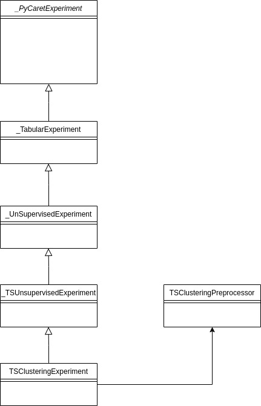

## Introduction
This document will outline the design behind the clustering time series module in pycaret

### Class Architecture

The class architecture will reuse some of the inheritance hierarchy that already exists for the time series forecasting supervised learning algos, namely a new class will be introduced for capturing experiment details and will act as a mixin containing preprocessing functionality and embed functionality around an ml pipeline.
 This diagram how a timeseries clustering experiment will leverage sktime, specifically the time series clustering component of sktime

### Design Details
The TSClusteringExperiment structure will branch out and compute the following clustering algorithms
* kmeans
* kmeans_dba
* kmedoids
* kshapes
* kernel_k_means
* lloyds

```Test implementation of Kmeans using sktime dba.
def setup_train_test(self):
    X_train, y_train = load_basic_motions(split="train")
    X_test, y_test = load_basic_motions(split="test")


def run_prediction_pipeline(self):
    num_test_values = 5

    kmeans = TimeSeriesKMeans(
        averaging_method="dba",
        random_state=1,
        n_init=2,
        n_clusters=4,
        init_algorithm="kmeans++",
        metric="dtw",
    )
    train_predict = kmeans.fit_predict(X_train.head(num_test_values))
    
def evaluate_result(self):
    train_mean_score = metrics.rand_score(y_train[0:num_test_values], train_predict)

    test_mean_result = kmeans.predict(X_test.head(num_test_values))
    mean_score = metrics.rand_score(y_test[0:num_test_values], test_mean_result)
    proba_result = kmeans.predict_proba(X_test.head(num_test_values))
```


```Test implementation of Kmeans using sktime.
def setup_train_test(self):
    X_train, y_train = load_basic_motions(split="train")
    X_test, y_test = load_basic_motions(split="test")


def run_prediction_pipeline(self):
    kmeans = TimeSeriesKMeans(
        averaging_method="mean",
        random_state=1,
        n_init=2,
        n_clusters=4,
        init_algorithm="kmeans++",
        metric="euclidean",
    )
    train_predict = kmeans.fit_predict(X_train)

def evaluate_result(self):
    train_mean_score = metrics.rand_score(y_train, train_predict)

    test_mean_result = kmeans.predict(X_test)
    mean_score = metrics.rand_score(y_test, test_mean_result)
    proba = kmeans.predict_proba(X_test)
```